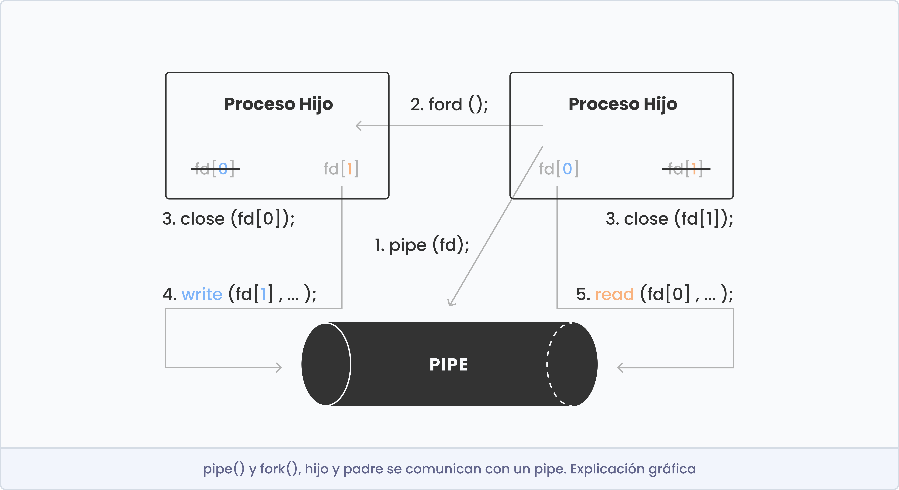

# Pipex - In Process

## To do
- mirar como funciona execve() y fork()
- mirar como funciona pipe()
- mirar como funciona el PATH del enviroment y una parsearlo (la funcion access() con el flag X_OK te puede ayudar para encontrar el binario)


## Función execve()

```shell
int execve(const char *filename, char *const argv[], char *const envp[]);
```

### Descripción
La función execve() se utiliza para **ejecutar un programa externo desde dentro de un programa**.

- Filename (la ruta al archivo ejecutable): Se debe proporcionar la ruta al archivo ejecutable que se desea ejecutar. Esta ruta debe ser un puntero a una cadena de caracteres que contiene la ruta completa al archivo ejecutable.

	Para saber la ruta del archivo ejecutable, por ejemplo de 'ls' en el sistema, podemos ejecutar el siguiente comando en la terminal: `which ls`

	Este comando mostrará la ubicación exacta del archivo ejecutable. En este caso 'ls' se encuentra en la ruta '/bin/ls' del sistema.

- Argv (argumentos del programa): El segundo argumento es un array de punteros a cadenas de caracteres que representan los argumentos que se deben pasar al programa que se está ejecutando. El primer elemento del array debe contener el filename asociado al archivo ejecutable que se desea ejecutar. Tanto argv como envp tienen que terminar con un puntero NULL.

- Envp (variables de entorno): El tercer argumento es un array de punteros a cadenas de caracteres que representan las variables de entorno que se deben pasar al programa que se está ejecutando.

### Valor devuelto
En caso de éxito execve() no regresa mientas que en caso de error el valor devuelto es -1, y a la variable errno se le asigna un valor apropiado.

### Ejemplo:

```shell
int	main(void)
{
	int val;

	char *args[] = { "/bin/ls", "-l", NULL };
	val = execve(args[0], args, NULL);
	if (val == -1)
		perror("Error");
	return (0);
}
```

## Función fork()

```shell
pid_t fork(void);
```

### Descripción
La llamada al sistema Fork crea un nuevo proceso llamado proceso hijo, que es una copia exacta del proceso padre que lo creó.

- Tienen PIDs diferentes.
- Corren en espacios de memoria separados.

Nota (mia): es mejor matar al padre primero ya que si se mata al hijo, quedará zombi. Es decir, este habrá terminado pero queda de alguna manera representado en el sistema, almacenando algunos recursos.

### Valor devuelto
- En caso de exito:
	- Retorno al padre: PID del hijo.
	- Retorno al hijo: 0.
- Si hay errores:
	- Retorno al padre: -1
	- (el hijo no es creado)

### Ejemplo 01:

```shell
int	main(void)
{
	fork();
	printf("Hello\n");
	return (0);
}
```
```bash
Hello
Hello
```

### Ejemplo 02:

```shell
void forexample(void)
{
	int pid = fork();
	int x = 1;

	// instrucciones que tanto el padre como el hijo harán

	if (pid >= 0)
	{
		// instrucciones que solo el proceso padre hará
		printf("Parent has x = %d\n", --x);
	}
	if (pid == 0)
	{
		// instrucciones que solo el proceso hijo hará
		printf("Child has x = %d\n", ++x);
	}
}

int	main(void)
{
	forexample();
	return (0);
}
```
```bash
Parent has x = 0
Child has x = 2
```

## Función pipe()

```shell
int pipe(int fd[2]);
```

### Descripción
- Es un mecanismo IPC (comunicación entre procesos) unidireccional.
- Comunican procesos "relacionados". Ej: padre e hijo, hijo e hijo.
- Pipe asociado a dos fd:
	- fd[0]: READ.
	- fd[1]: WRITE.

### Valor devuelto
En caso de éxito pipe() devuelve 0, mientas que en caso de error el valor devuelto es -1.

### Funciones relacionadas:

<table>
    <thead>
        <tr>
            <th align="left">Descripción</th>
            <th align="left">Función</th>
        </tr>
    </thead>
    <tbody>
		<tr>
            <td valign="top"><b>Escribir</b></td>
            <td valign="top">ssize_t write(int fd, const void *buf, size_t nr)</td>
        </tr>
		<tr>
            <td valign="top"><b>Leer</b></td>
            <td valign="top">ssize_t read(int fd, void *buf, size_t nr)</td>
        </tr>
		<tr>
            <td valign="top"><b>Cerrar</b></td>
            <td valign="top">int close(int fd)</td>
        </tr>
	</tbody>
<table>

<p align="center">
  
</p>

ls = fd[0] | fd[1] = wc
