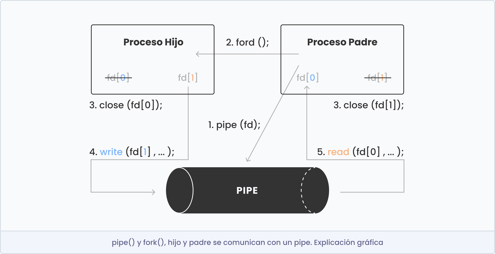

# Pipex - In Process

## To do
- mirar como funciona execve() y fork()
- mirar como funciona pipe()
- mirar como funciona el PATH del enviroment y una parsearlo (la funcion access() con el flag X_OK te puede ayudar para encontrar el binario)


## Función execve()

```c
int execve(const char *filename, char *const argv[], char *const envp[]);
```

### Descripción
La función execve() se utiliza para **ejecutar un programa externo desde dentro de un programa**.

- Filename (la ruta al archivo ejecutable): Se debe proporcionar la ruta al archivo ejecutable que se desea ejecutar. Esta ruta debe ser un puntero a una cadena de caracteres que contiene la ruta completa al archivo ejecutable.

	Para saber la ruta del archivo ejecutable, por ejemplo de 'ls' en el sistema, podemos ejecutar el siguiente comando en la terminal: `which ls`

	Este comando mostrará la ubicación exacta del archivo ejecutable. En este caso 'ls' se encuentra en la ruta '/bin/ls' del sistema.

- Argv (argumentos del programa): El segundo argumento es un array de punteros a cadenas de caracteres que representan los argumentos que se deben pasar al programa que se está ejecutando. El primer elemento del array debe contener el filename asociado al archivo ejecutable que se desea ejecutar. Tanto argv como envp tienen que terminar con un puntero NULL.

- Envp (variables de entorno): El tercer argumento es un array de punteros a cadenas de caracteres que representan las variables de entorno que se deben pasar al programa que se está ejecutando.

### Valor devuelto
En caso de éxito execve() no regresa mientas que en caso de error el valor devuelto es -1, y a la variable errno se le asigna un valor apropiado.

### Ejemplo:

```c
int	main(void)
{
	int val;

	char *args[] = { "/bin/ls", "-l", NULL };
	val = execve(args[0], args, NULL);
	if (val == -1)
		perror("Error");
	return (0);
}
```

## Función fork()

```shell
pid_t fork(void);
```

### Descripción
La llamada al sistema Fork crea un nuevo proceso llamado proceso hijo, que es una copia exacta del proceso padre que lo creó.

- Tienen PIDs diferentes.
- Corren en espacios de memoria separados.

Nota: cuando se mata al hijo pero no al padre, este permanecerá zombi. Es decir, este habrá terminado pero quedará de alguna manera representado en el sistema, almacenando algunos recursos. Sin embargo, al contrario no se produce esta situación.

### Valor devuelto
- En caso de exito:
	- Retorno al padre: PID del hijo.
	- Retorno al hijo: 0.
- Si hay errores:
	- Retorno al padre: -1
	- (el hijo no es creado)

### Ejemplo 01:

```c
int	main(void)
{
	fork();
	printf("Hello\n");
	return (0);
}
```
```bash
Hello
Hello
```

### Ejemplo 02:

```c
void forexample(void)
{
	int pid = fork();
	int x = 1;

	// instrucciones que tanto el padre como el hijo harán

	if (pid >= 0)
	{
		// instrucciones que solo el proceso padre hará
		printf("Parent has x = %d\n", --x);
	}
	if (pid == 0)
	{
		// instrucciones que solo el proceso hijo hará
		printf("Child has x = %d\n", ++x);
	}
}

int	main(void)
{
	forexample();
	return (0);
}
```
```bash
Parent has x = 0
Child has x = 2
```

## Función pipe()

```c
int pipe(int fd[2]);
```

### Descripción
- Es un mecanismo IPC (comunicación entre procesos) unidireccional.
- Comunican procesos "relacionados". Ej: padre e hijo, hijo e hijo.
- Pipe asociado a dos fd:
	- fd[0]: READ.
	- fd[1]: WRITE.

### Valor devuelto
En caso de éxito pipe() devuelve 0, mientas que en caso de error el valor devuelto es -1.

### Funciones relacionadas
- Escribir: ssize_t write(int fd, const void *buf, size_t nr);
- Leer: ssize_t read(int fd, void *buf, size_t nr);
- Cerrar: int close(int fd);

### Ejemplo de comunicación entre pipe() y fork()

<p align="center">
  
</p>

```c
int	main(void)
{
	int fd[2];
	pid_t pidC;
	char buf[10];
	int num;

	pipe(fd); /* TODO: error manamgent. */
	pidC = fork();
	if (pidC == -1) /* error */
		return (1);
	if (pidC == 0) /* hijo */
	{
		close(fd[0]);
		write(fd[1], "abdce", 5);
		close(fd[1]);
	}
	else /* padre */
	{
		close(fd[1]);
		num = read(fd[0], buf, sizeof(buf));
		printf("Padre lee %d bytes: %s\n", num, buf);
		close(fd[0]);
	}
	return (0);
}
```

```bash
Padre lee 5 bytes: abdce
```

## Función dup() y dup2()

### Nombre
```
dup, dup2 - duplica un descriptor de fichero
```

### Sinopsis

```c
#include <unistd.h>

int dup(int oldfd);
int dup2(int oldfd, int newfd);
```

### Descripción

**dup** y **dup2** crea una copia del descriptor de fichero oldfd en newfd.

Después  de  una  llamada  a dup o dup2 con éxito, los descriptores antiguo y nuevo pueden usarse indiferentemente. Comparten candados (locks), indicadores de posición de fichero  y banderas  (flags); por ejemplo, si la posición del fichero se modifica usando lseek en uno de los descriptores, la posición en el otro también cambia.

Sin embargo los descriptores no comparten la bandera close-on-exec, (cerrar-al-ejecutar).

**dup** usa el descriptor libre con menor numeración posible como nuevo descriptor.

**dup2** hace que newfd sea la copia de oldfd, cerrando primero newfd si es necesario.


### Valor devuelto

**dup** y **dup2** devuelven el valor del nuevo descriptor, ó -1 si ocurre algún error, en cuyo caso errno toma un valor apropiado.


## Como empezar

### 0.1 Control de errores

	- Solo pueden haber 4 argumentos.
	- El primer archivo debe existir.

### 0.2 Ejecutar el primer comando

### 0.3 Ejecutar dicho comando desde el archivo 1

> y >>

La principal diferencia entre ellos radica en cómo manejan la salida cuando el archivo de destino ya existe:

> (redirección de salida sobrescrita): Si utilizas el operador >, la salida del comando se redirige hacia el archivo especificado, sobrescribiendo cualquier contenido previo que pudiera tener. Si el archivo no existe, se crea.

>> (redirección de salida agregada): Por otro lado, si utilizas el operador >>, la salida del comando se agrega al final del archivo especificado, preservando cualquier contenido existente. Si el archivo no existe, se crea.
