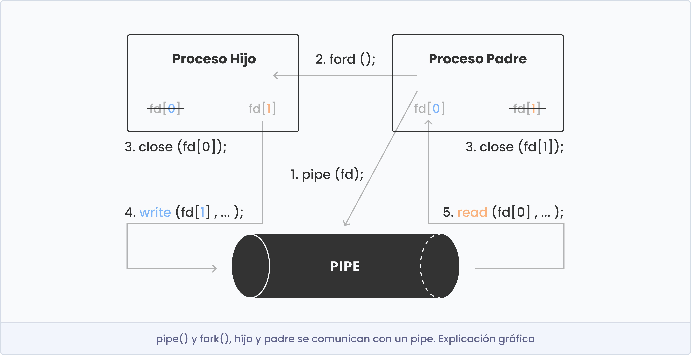

## Función pipe()

```c
int pipe(int fd[2]);
```

### Descripción
- Es un mecanismo IPC (comunicación entre procesos) unidireccional.
- Comunican procesos "relacionados". Ej: padre e hijo, hijo e hijo.
- Pipe asociado a dos fd:
	- fd[0]: READ.
	- fd[1]: WRITE.

### Valor devuelto
En caso de éxito pipe() devuelve 0, mientas que en caso de error el valor devuelto es -1.

### Funciones relacionadas
- Escribir: ssize_t write(int fd, const void *buf, size_t nr);
- Leer: ssize_t read(int fd, void *buf, size_t nr);
- Cerrar: int close(int fd);

### Ejemplo de comunicación entre pipe() y fork()

<p align="center">
  
</p>

```c
int	main(void)
{
	int fd[2];
	pid_t pidC;
	char buf[10];
	int num;

	pipe(fd); /* TODO: error manamgent. */
	pidC = fork();
	if (pidC == -1) /* error */
		return (1);
	if (pidC == 0) /* hijo */
	{
		close(fd[0]);
		write(fd[1], "abdce", 5);
		close(fd[1]);
	}
	else /* padre */
	{
		close(fd[1]);
		num = read(fd[0], buf, sizeof(buf));
		printf("Padre lee %d bytes: %s\n", num, buf);
		close(fd[0]);
	}
	return (0);
}
```

```bash
Padre lee 5 bytes: abdce
```
