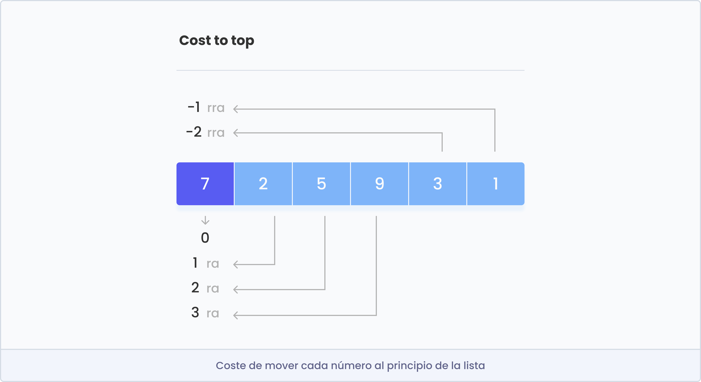
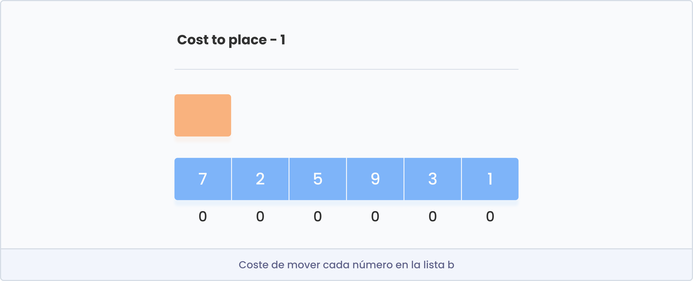
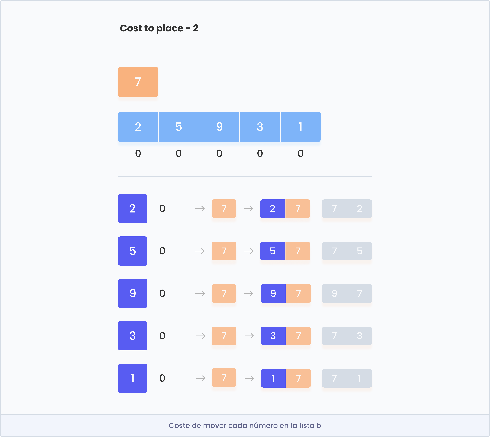
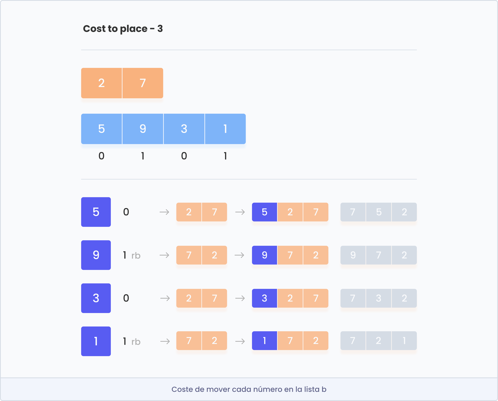
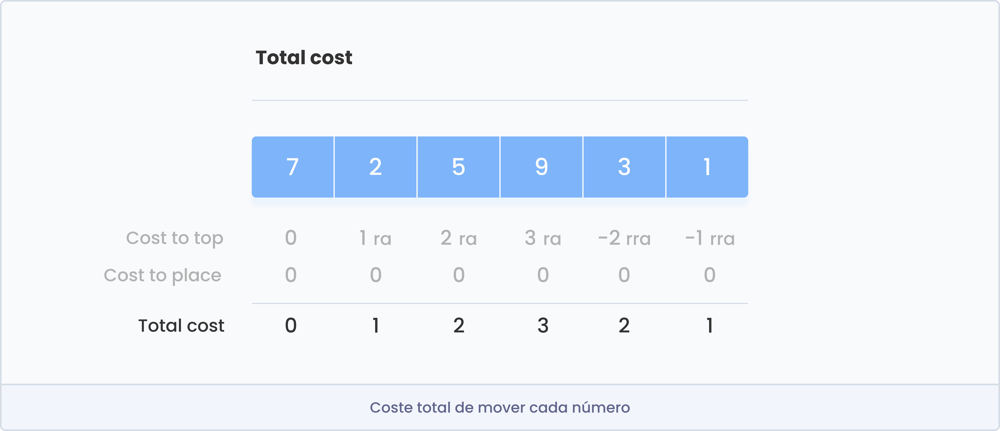
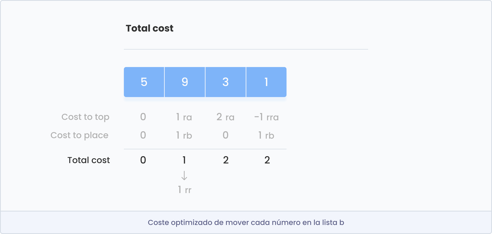

<p align="center">
  
</p>

# Push_Swap

***El objetivo del proyecto push_swap es programar un algoritmo de ordenamiento.***

Este programa deberá ordenar una lista dada de números aleatorios, a través de unas instrucciones, utilizando el menor número de acciones posibles. Para ello, tendremos que manipular varios tipos de algoritmos y elegir la solución más adecuada para una ordenación optimizada de los datos. Este proyecto es un gran ejemplo para aprender a trabajar con listas, por lo que recomiendo utilizarlas.


## Enunciado del ejercicio
- Disponemos de dos listas, llamadas A y B. La primera lista comenzará llena de todos los números a tratar por el programa, mientras que la segunda comenzará vacía.
- El objetivo es ordenar la lista A en orden ascendente con la ayuda de la lista B.
- Para hacerlo se deben seguir las siguientes instrucciones:

<table align="center">
    <thead>
        <tr>
            <th align="left">Nombre</th>
            <th align="left">Instrucción</th>
            <th align="left">Descripción</th>
        </tr>
    </thead>
    <tbody>
	<tr>
            <td>sa</td>
            <td><a href=https://github.com/lbengo/42_School/blob/main/Cursus/push_swap/src/game_rules/swap.c>swap_a</a></td>
            <td>Intercambia los dos primeros elementos encima de la lista A.</td>
    </tr>
	<tr>
            <td>sb</td>
            <td><a href=https://github.com/lbengo/42_School/blob/main/Cursus/push_swap/src/game_rules/swap.c>swap_b</a></td>
            <td>Intercambia los dos primeros elementos encima de la lista B.</td>
    </tr>
	<tr>
            <td>ss</td>
            <td><a href=https://github.com/lbengo/42_School/blob/main/Cursus/push_swap/src/game_rules/swap.c>swap_a_b</a></td>
            <td>swap_a y swap_b a la vez</td>
    </tr>
	<tr>
            <td>ra</td>
            <td><a href=https://github.com/lbengo/42_School/blob/main/Cursus/push_swap/src/game_rules/rotate.c>rotate_a</a></td>
		      	<td>El primer elemento de la lista A pasa al último.</td>
    </tr>
	<tr>
            <td>rb</td>
            <td><a href=https://github.com/lbengo/42_School/blob/main/Cursus/push_swap/src/game_rules/rotate.c>rotate_b</a></td>
		      	<td>El primer elemento de la lista B pasa al último.</td>
    </tr>
	<tr>
            <td>rr</td>
            <td><a href=https://github.com/lbengo/42_School/blob/main/Cursus/push_swap/src/game_rules/rotate.c>rotate_a_b</a></td>
	      		<td>El primer elemento de la lista A y B pasan al último.</td>
    </tr>
	<tr>
            <td>rra</td>
            <td><a href=https://github.com/lbengo/42_School/blob/main/Cursus/push_swap/src/game_rules/reverse_rotate.c>reverse_rotate_a</a></td>
		      	<td>El último elemento de la lista A pasa al primero.</td>
    </tr>
	<tr>
            <td>rrb</td>
            <td><a href=https://github.com/lbengo/42_School/blob/main/Cursus/push_swap/src/game_rules/reverse_rotate.c>reverse_rotate_b</a></td>
		      	<td>El último elemento de la lista A pasa al primero.</td>
    </tr>
	<tr>
            <td>rrr</td>
            <td><a href=https://github.com/lbengo/42_School/blob/main/Cursus/push_swap/src/game_rules/reverse_rotate.c>reverse_rotate_a_b</a></td>
		      	<td>El último elemento de la lista A y B pasan al primero.</td>
    </tr>
		<tr>
            <td>pa</td>
            <td><a href=https://github.com/lbengo/42_School/blob/main/Cursus/push_swap/src/game_rules/push.c>push_a</a></td>
            <td>Toma el primer elemento de la lista B y lo situa al principio de la lista A.</td>
    </tr>
	<tr>
            <td>pb</td>
            <td><a href=https://github.com/lbengo/42_School/blob/main/Cursus/push_swap/src/game_rules/push.c>push_b</a></td>
		      	<td>Toma el primer elemento de la lista A y lo situa al principio de la lista B.</td>
    </tr>
	</tbody>
<table>


## Cómo testear
Ejecuta los siguientes comandos.
```shell
$ git clone https://github.com/lbengo/42_School.git && cd 42_School/Cursus/push_swap/
$ make
$ ./push_swap [arg1] [arg2] [arg3]
```
> Puedes sustituir los números por los que prefieras (en el rango de un int).


## Forma de evaluar

- Cuando se proporcionan 3 argumentos: No se permiten más de 3 movimientos.
- Cuando se proporcionan 5 argumentos: No se permiten más de 12 movimientos.
- Cuando se proporcionan 100 argumentos: Se puntuará de 1 hasta 5 dependiendo de los movimientos ejecutados.
	- 5 puntos. Movimientos realizados <= 700
	- 4 puntos. 700 < movimientos <= 900
	- 3 puntos. 900 < movimientos <= 1100
	- 2 puntos. 1100 < movimientos <= 1300
	- 1 puntos. 1300 < movimientos <= 1500

- Cuando se proporcionan 500 argumentos: Se puntuará de 1 hasta 5 dependiendo de los movimientos ejecutados.
	- 5 puntos. Movimientos realizados <= 5500
	- 4 puntos. 5501 < movimientos <= 7000
	- 3 puntos. 7000 < movimientos <= 8500
	- 2 puntos. 8500 < movimientos <= 10000
	- 1 puntos. 10000 < movimientos <= 11500

> Para comprobar los valores de entrada más facilmente puedes añadir wc -l. Ej: ./push_swap [arg1] [arg2] [arg3] | wc -l


## Cómo empezar

### 01. Control de errores
Errores a gestionar
- Números positivos y/o negativos. Ej: 2 -2 7 / 4 3 5 / -5 -1 -9
- Alguno de los números es más grande que un int
- Nunca duplicados (Cuidado con: 0 -0 / -05 -5 / 5 +5)
- Separados solo por un espacio
- Los valores pueden entrar tanto por argumentos como por arrays. Ej: 5 "3 8" / 5 3 8 / "5 3 8"

### 02. Añadir los valores a la lista a
Para ello, primero realicé algunas funciones básicas para las listas como por ejemplo: "ft_lstnew", "ft_lstsize" o "ft_lstadd_front", entre otras. Y, a continuación, las empleé con el objetivo de incorporar los valores a la lista A.

### 03. Creación de las instrucciones
Tras haber rellenado la lista, realicé las instrucciones del push_swap (sa, rb, pa, ...) y comprobé que su funionamiento fuera correcto. Previniendo con ello errores al realizar el algoritmo.

### 04. Implementación del algoritmo: Insertion Sort
Tras evaluar y estudiar diferentes algoritmos, el que se ha seguido en este proyecto es el Insertion Sort ya que me ha parecido más intuitivo y fácil de implementar.

El Insertion Sort es un algoritmo de ordenación que coloca un elemento sin ordenar (de la lista A) en su lugar adecuado (de la lista B) en cada iteración. Veamos a continuación más detalladamente los pasos de este algoritmo:

<p align="center">
  
</p>

En primer lugar, calculamos el coste total que nos supone mover cada número de la lista A a la lista B, seleccionando aquel que requiera un menor número de movimientos, consiguiendo con ello una ordenación más optimizada. Para ello, el coste total se divide en dos: "cost_to_top" y "cost_to_place".

### 04.1 Calcular "Cost_to_top"

"Cost_to_top" referencia al número de movimientos de cada número para situarse en la parte superior de la misma lista. A través de este obtenemos los movimientos de la lista A, cuyas instrucciones son: ra y rra.

<p align="center">
  
</p>

### 04.2 Calcular "Cost_to_place"

Por otro lado, "Cost_to_place" es la cantidad de movimientos que tiene que suceder en la lista B para que cuando un elemento de la lista A se inserte la lista B siga en orden. Mediante este procedimiento se obtienen los movimientos de la lista B, cuyas instrucciones son: rb y rrb.

<p align="center">
  
</p>

Como se puede apreciar en la imagen, "Cost_to_place" no tendrá ningún valor en los primeros dos movimientos ya que cualquier número es indiferente en su colocación.

<p align="center">
  
</p>

Una vez ya se tienen más de dos valores en la lista B, "Cost_to_place" comienza a tener valor. Como se ha mencionado anteriormente, el número dependerá de los movimientos que se requieran hacer en la lista B para situar los números de la lista A.

Un consejo a tener en cuenta es que los números de la lista B se situen de mayor a menor, con el objetivo de enviar posteriormente de forma correcta a la lista A, la cual quedará ordenada de menor a mayor.

Otro consejo a mencionar en la realización de "Cost_to_place" es imaginarte la lista B como si fuese circular. Es decir, no hace falta que esté ordenada en todo momento (comenzando con el número mayor), ya que esto hace que disminuyan los movimientos.

<p align="center">
  
</p>

<p align="center">
  
</p>

### 04.3 Calcular el coste total

A continuación, se calcula el número total de coste de cada número. Para ello, se suman los valores absolutos de "Cost_to_top" y "Cost_to_place". Sin embargo, en el caso de que sean ambos del mismo signo (+ o -) prevalecerá aquel que tenga un valor mayor, ya que se puede optimizar el algorítmo con las instrucciones: rr y rrr.

<p align="center">
  
</p>

<p align="center">
  
</p>

### 04.4 Traspaso a la lista b

Una vez sepamos el coste total de los números de la lista A, se selecciona el que suponga menos movimientos y se pasa a la lista B.

<p align="center">
  
</p>

### 04.5 Ordenamiento de la lista b
Tras haber vaciado tota la lista A, tendremos la lista B de mayor a menor. Sin embargo, es muy probable que el mayor número no esté en primer lugar, por lo que se deberá ordenar previamente a enviarlo a la lista A.

<p align="center">
  
</p>

### 04.6 Traspaso a la lista a y final

Por último, pasaremos los números, uno por uno, a la lista A, la cual finalizará totalmente ordenada.

<p align="center">
  
</p>


**shoutout**
- Aarrien- y Ubegona por enseñarme y ayudarme a entender el algoritmo.
- Jofernan, Becastro, Aalvarez, Dampuru y muchos más por ayudarme a mejorar.

Muchas gracias a todos :)

---
Made by lbengoec: lbengoec@student.42urduliz.com | LinkedIn: [lbengoec](https://www.linkedin.com/in/laura-bengoechea-navarro/)
